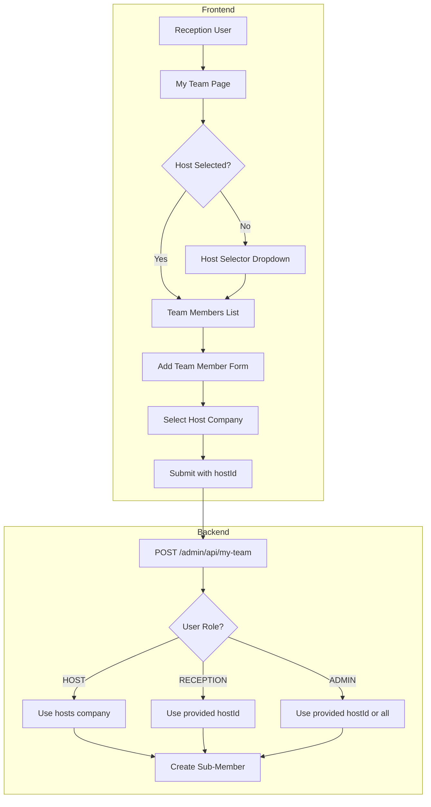
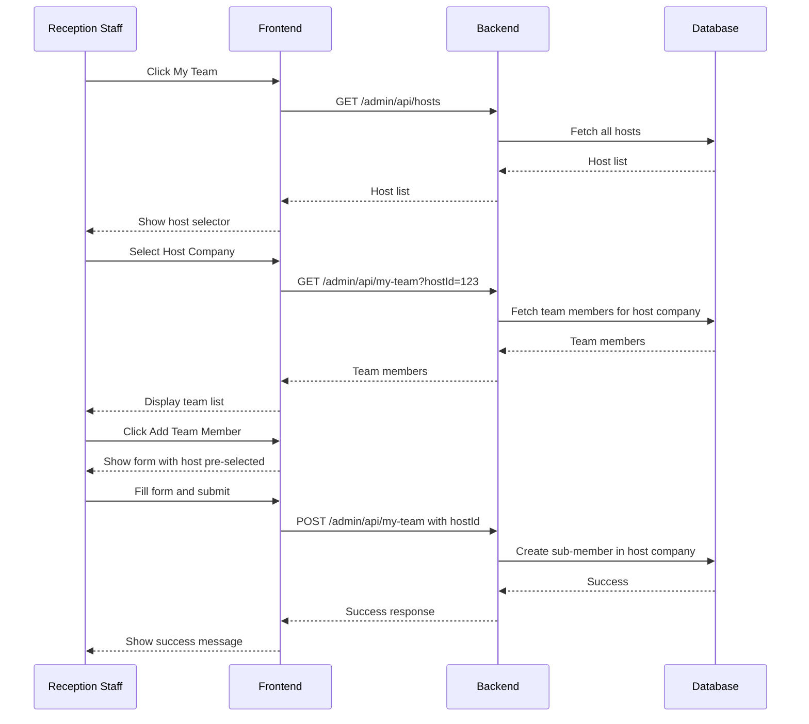

# Reception-to-Host Delegation Feature Plan

## Overview

Enable RECEPTION staff to add sub-members (team members) to hosts on behalf of them. This feature allows reception staff to support hosts who request assistance with managing their team members.

## Current State Analysis

### Existing My Team Feature
- **Access**: Only `ADMIN` and `HOST` roles
- **Backend Endpoints**: 
  - `POST /admin/api/my-team` - Create team member
  - `GET /admin/api/my-team` - List team members
  - `PATCH /admin/api/my-team/:id` - Update team member
  - `PATCH /admin/api/my-team/:id/status` - Toggle status
- **Scope**: Company-based (HOST users can only manage members in their own company)
- **Frontend**: Navigation only visible to `HOST` role

### Role Permissions Matrix

| Feature | ADMIN | RECEPTION | HOST | STAFF |
|---------|-------|-----------|------|-------|
| My Team | ❌* | ❌ | ✅ | ❌ |
| Visitors | ✅ | ✅ | ✅ | ✅ |
| Hosts | ✅ | ✅ | ✅ | ❌ |
| Pre-Register | ✅ | ✅ | ✅ | ✅ |
| Deliveries | ✅ | ✅ | ✅ | ✅ |

*ADMIN has access via Users page but not My Team navigation

## Proposed Solution

### Architecture Diagram



### User Flow



## Implementation Details

### 1. Backend Changes

#### 1.1 Update my-team Endpoints to Support RECEPTION Role

**File**: `backend/src/admin/admin.controller.ts`

##### POST /admin/api/my-team
```typescript
// Current
@Roles(Role.ADMIN, Role.HOST)
@Post("my-team")
async createTeamMember(...)

// Updated
@Roles(Role.ADMIN, Role.HOST, Role.RECEPTION)
@Post("my-team")
async createTeamMember(
  @Req() req: any,
  @Body() body: {
    name: string;
    email: string;
    phone?: string;
    hostId?: string; // Required for RECEPTION/ADMIN, auto-filled for HOST
  },
) {
  let targetCompany: string;
  let targetLocation: string | null = null;

  // For HOST users: use their own company
  if (req.user?.role === "HOST" && req.user?.hostId) {
    const hostScope = await this.getHostScope(req);
    if (!hostScope) {
      throw new ForbiddenException("Host record not found");
    }
    targetCompany = hostScope.company;
    const hostRecord = await this.prisma.host.findUnique({
      where: { id: hostScope.hostId },
      select: { location: true, status: true },
    });
    targetLocation = hostRecord?.location || null;
  } 
  // For RECEPTION/ADMIN: require hostId to determine company
  else if (req.user?.role === "RECEPTION" || req.user?.role === "ADMIN") {
    if (!body.hostId) {
      throw new HttpException(
        "hostId is required for RECEPTION/ADMIN users",
        HttpStatus.BAD_REQUEST,
      );
    }
    const targetHost = await this.prisma.host.findUnique({
      where: { id: BigInt(body.hostId) },
      select: { company: true, location: true, status: true },
    });
    if (!targetHost || targetHost.status !== 1) {
      throw new HttpException(
        "Host not found or inactive",
        HttpStatus.NOT_FOUND,
      );
    }
    targetCompany = targetHost.company;
    targetLocation = targetHost.location;
  }

  // Rest of the creation logic...
}
```

##### GET /admin/api/my-team
```typescript
// Updated
@Roles(Role.ADMIN, Role.HOST, Role.RECEPTION)
@Get("my-team")
async getMyTeam(
  @Req() req: any,
  @Query("page") page = "1",
  @Query("limit") limit = "10",
  @Query("search") search?: string,
  @Query("status") status?: string,
  @Query("hostId") hostId?: string, // Required for RECEPTION/ADMIN
) {
  let company: string;

  // For HOST: use their company
  if (req.user?.role === "HOST") {
    const hostScope = await this.getHostScope(req);
    if (!hostScope) {
      throw new ForbiddenException("Host record not found");
    }
    company = hostScope.company;
  } 
  // For RECEPTION/ADMIN: require hostId
  else if (req.user?.role === "RECEPTION" || req.user?.role === "ADMIN") {
    if (!hostId) {
      throw new HttpException(
        "hostId query parameter is required",
        HttpStatus.BAD_REQUEST,
      );
    }
    const targetHost = await this.prisma.host.findUnique({
      where: { id: BigInt(hostId) },
      select: { company: true },
    });
    if (!targetHost) {
      throw new HttpException("Host not found", HttpStatus.NOT_FOUND);
    }
    company = targetHost.company;
  }

  // Query with company filter...
}
```

##### PATCH /admin/api/my-team/:id
```typescript
// Updated
@Roles(Role.ADMIN, Role.HOST, Role.RECEPTION)
@Patch("my-team/:id")
async updateTeamMember(
  @Param("id") id: string,
  @Req() req: any,
  @Body() body: { name?: string; email?: string; phone?: string },
) {
  // Similar logic: HOST uses their company, RECEPTION/ADMIN verify via team member's company
}
```

##### PATCH /admin/api/my-team/:id/status
```typescript
// Updated
@Roles(Role.ADMIN, Role.HOST, Role.RECEPTION)
@Patch("my-team/:id/status")
async toggleTeamMemberStatus(
  @Param("id") id: string,
  @Req() req: any,
  @Body() body: { status: 0 | 1 },
) {
  // Similar logic
}
```

### 2. Frontend Changes

#### 2.1 Update Navigation

**File**: `admin/src/config/navigation.ts`

```typescript
{
  path: '/admin/my-team',
  label: 'My Team',
  icon: 'Users',
  roles: ['HOST', 'RECEPTION'], // Added RECEPTION
},
```

#### 2.2 Create Host Selector Component

**File**: `admin/src/components/common/HostCompanySelector.tsx`

```typescript
import { useState, useEffect } from 'react'
import { getHosts } from '@/services/hosts'
import type { Host } from '@/types'

interface HostCompanySelectorProps {
  value: string | null
  onChange: (hostId: string, company: string) => void
  disabled?: boolean
}

export default function HostCompanySelector({
  value,
  onChange,
  disabled,
}: HostCompanySelectorProps) {
  const [hosts, setHosts] = useState<Host[]>([])
  const [isLoading, setIsLoading] = useState(false)
  const [search, setSearch] = useState('')

  useEffect(() => {
    setIsLoading(true)
    getHosts({ search, limit: 50 })
      .then(res => setHosts(res.data || []))
      .finally(() => setIsLoading(false))
  }, [search])

  return (
    <div className="space-y-2">
      <label className="block text-sm font-medium text-gray-700">
        Select Host Company *
      </label>
      <select
        value={value || ''}
        onChange={(e) => {
          const selected = hosts.find(h => String(h.id) === e.target.value)
          if (selected) {
            onChange(e.target.value, selected.company || '')
          }
        }}
        disabled={disabled || isLoading}
        className="w-full px-3 py-2 border border-gray-300 rounded-lg"
      >
        <option value="">
          {isLoading ? 'Loading hosts...' : 'Select a host company'}
        </option>
        {hosts.map(host => (
          <option key={host.id} value={String(host.id)}>
            {host.name} - {host.company}
          </option>
        ))}
      </select>
    </div>
  )
}
```

#### 2.3 Update MyTeam Component

**File**: `admin/src/components/my-team/MyTeam.tsx`

Key changes:
1. Detect user role
2. For RECEPTION: Show host selector at top
3. Pass `hostId` to API calls when user is RECEPTION
4. Update form to include hostId for RECEPTION users

```typescript
import { useAuth } from '@/hooks/useAuth'
import HostCompanySelector from '@/components/common/HostCompanySelector'

export default function MyTeam() {
  const { user } = useAuth()
  const isReception = user?.role === 'RECEPTION'
  const [selectedHostId, setSelectedHostId] = useState<string | null>(null)
  const [selectedCompany, setSelectedCompany] = useState<string>('')

  // For RECEPTION: require host selection before showing team
  const canShowTeam = !isReception || selectedHostId

  const fetchTeamMembers = useCallback(async (page = 1, search = '') => {
    const params: any = { page, limit: pagination.limit, search }
    if (isReception && selectedHostId) {
      params.hostId = selectedHostId
    }
    const response = await getMyTeam(params)
    // ...
  }, [isReception, selectedHostId, pagination.limit])

  const handleFormSubmit = async (data: any) => {
    const submitData = { ...data }
    if (isReception && selectedHostId) {
      submitData.hostId = selectedHostId
    }
    // Call API with submitData
  }

  return (
    <div>
      {/* Header */}
      <div className="px-6 py-4 border-b">
        <h1>My Team</h1>
        {isReception && (
          <p className="text-sm text-gray-500">
            Managing team on behalf of: {selectedCompany || 'Select a host'}
          </p>
        )}
      </div>

      {/* Host Selector for RECEPTION */}
      {isReception && (
        <div className="px-6 py-4 border-b bg-blue-50">
          <HostCompanySelector
            value={selectedHostId}
            onChange={(hostId, company) => {
              setSelectedHostId(hostId)
              setSelectedCompany(company)
              // Refresh team list
              fetchTeamMembers(1, '')
            }}
          />
        </div>
      )}

      {/* Team List - only show when host is selected for RECEPTION */}
      {canShowTeam ? (
        <HostsList ... />
      ) : (
        <div className="p-12 text-center text-gray-500">
          Please select a host company to manage their team members
        </div>
      )}
    </div>
  )
}
```

#### 2.4 Update API Service

**File**: `admin/src/services/myTeam.ts`

```typescript
interface GetMyTeamParams {
  page?: number
  limit?: number
  search?: string
  status?: number
  hostId?: string // Added for RECEPTION/ADMIN
}

export const getMyTeam = async (params?: GetMyTeamParams) => {
  const queryString = new URLSearchParams()
  if (params?.page) queryString.append('page', params.page.toString())
  if (params?.limit) queryString.append('limit', params.limit.toString())
  if (params?.search) queryString.append('search', params.search)
  if (params?.status !== undefined) queryString.append('status', params.status.toString())
  if (params?.hostId) queryString.append('hostId', params.hostId) // New

  const query = queryString.toString()
  const url = `/admin/api/my-team${query ? `?${query}` : ''}`
  return api.get<PaginatedResponse<Host>>(url)
}

interface TeamMemberFormData {
  name: string
  email: string
  phone?: string
  hostId?: string // Added for RECEPTION/ADMIN
}

export const createTeamMember = async (data: TeamMemberFormData) => {
  return api.post<Host>('/admin/api/my-team', data)
}
```

### 3. Mobile App Changes (Optional)

If the mobile app needs this feature:

1. Add `MyTeamScreen` for RECEPTION role
2. Include host selector
3. Update API client with new endpoints

## Testing Checklist

### Backend Tests
- [ ] RECEPTION can create team member with valid hostId
- [ ] RECEPTION cannot create team member without hostId
- [ ] RECEPTION can list team members with hostId
- [ ] RECEPTION can update team member
- [ ] RECEPTION can toggle team member status
- [ ] HOST still works with auto-company detection
- [ ] ADMIN can manage any company's team

### Frontend Tests
- [ ] My Team navigation visible to RECEPTION
- [ ] Host selector appears for RECEPTION users
- [ ] Team list loads after host selection
- [ ] Add form includes hostId for RECEPTION
- [ ] HOST users see their own team without selector
- [ ] Error handling for invalid host selection

### Integration Tests
- [ ] Full flow: Select host → View team → Add member → Verify
- [ ] Cross-company access prevention
- [ ] Status toggle reflects immediately

## Security Considerations

1. **Authorization**: RECEPTION can only access companies via valid hostId
2. **Validation**: Backend validates hostId exists and is active
3. **Audit Trail**: Track who created/modified team members
4. **Rate Limiting**: Apply existing rate limits to new endpoints

## Rollback Plan

If issues arise:
1. Remove RECEPTION from `@Roles()` decorators
2. Remove RECEPTION from navigation roles
3. Feature is disabled immediately

## Estimated Effort

| Task | Complexity |
|------|------------|
| Backend role updates | Low |
| Frontend host selector | Medium |
| MyTeam component update | Medium |
| API service updates | Low |
| Testing | Medium |
| Documentation | Low |

## Success Criteria

1. ✅ RECEPTION staff can access My Team page
2. ✅ RECEPTION can select a host company
3. ✅ RECEPTION can view team members of selected host
4. ✅ RECEPTION can add new sub-members to selected host's company
5. ✅ RECEPTION can edit/toggle status of team members
6. ✅ HOST users experience no change in functionality
7. ✅ Proper error messages for invalid operations
